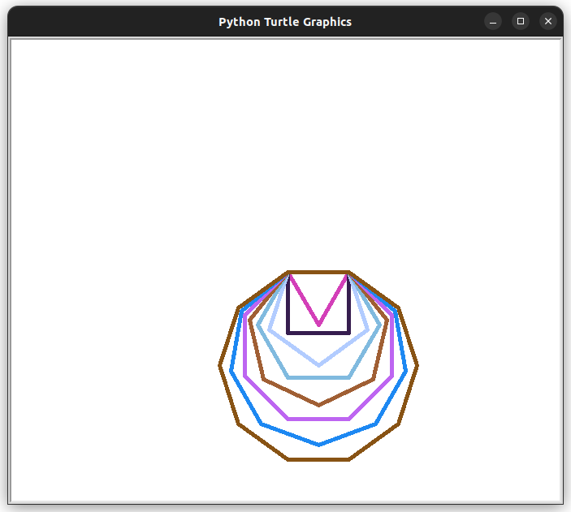

# Draw Polygons using Python

Tejas [twitter](https://twitter.com/achte_te)

Using Python to draw polygons from a Triangle to a Decagon.

### Requirements:
[Turtle](https://docs.python.org/3/library/turtle.html)


To Run:

```sh
git clone git@github.com:achte-2022/Draw-Polygon.git
cd Draw-Polygon
python3 main.py
```

### Output Image:

